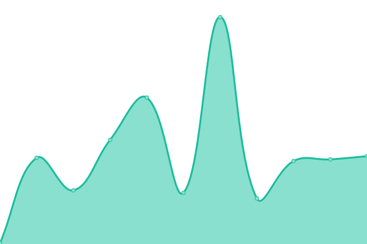

# [📈 Live Status](https://upptime.github.io/upptime): <!--live status--> **🟩 All systems operational**

This repository contains the open-source uptime monitor and status page for [Upptime](https://upptime.js.org), powered by [Upptime](https://github.com/upptime/upptime).

With [Upptime](https://upptime.js.org), you can get your own unlimited and free uptime monitor and status page, powered entirely by a GitHub repository. We use [Issues](https://github.com/upptime/upptime/issues) as incident reports, [Actions](https://github.com/lordronz/status/actions) as uptime monitors, and [Pages](https://upptime.github.io/upptime) for the status page.

<!--start: status pages-->
<!-- This summary is generated by Upptime (https://github.com/upptime/upptime) -->
<!-- Do not edit this manually, your changes will be overwritten -->
<!-- prettier-ignore -->
| URL | Status | History | Response Time | Uptime |
| --- | ------ | ------- | ------------- | ------ |
|  Pog Bot | 🟩 Up | [pog-bot.yml](https://github.com/LordRonz/status/commits/HEAD/history/pog-bot.yml) | 

 2800ms
     
 | 

<a href="https://lordronz.github.io/status/history/pog-bot">84.90%</a>
    

|  Ronz AMOGUS Bot | 🟩 Up | [ronz-amogus-bot.yml](https://github.com/LordRonz/status/commits/HEAD/history/ronz-amogus-bot.yml) | 

 2987ms
     
 | 

<a href="https://lordronz.github.io/status/history/ronz-amogus-bot">87.03%</a>
    

|  [DTK Class Helper](https://dtk-class.vercel.app) | 🟩 Up | [dtk-class-helper.yml](https://github.com/LordRonz/status/commits/HEAD/history/dtk-class-helper.yml) | 

 100ms
     
 | 

<a href="https://lordronz.github.io/status/history/dtk-class-helper">100.00%</a>
    

|  [Link Shortener](https://lr-link.vercel.app) | 🟩 Up | [link-shortener.yml](https://github.com/LordRonz/status/commits/HEAD/history/link-shortener.yml) | 

 1478ms
     
 | 

<a href="https://lordronz.github.io/status/history/link-shortener">100.00%</a>
    

|  [Pesan Awanama](https://lr-anon.vercel.app) | 🟩 Up | [pesan-awanama.yml](https://github.com/LordRonz/status/commits/HEAD/history/pesan-awanama.yml) | 

 51ms
     
 | 

<a href="https://lordronz.github.io/status/history/pesan-awanama">100.00%</a>
    

|  [Ronz Amogus Bot Documentation](https://ronz-amogus.vercel.app) | 🟩 Up | [ronz-amogus-bot-documentation.yml](https://github.com/LordRonz/status/commits/HEAD/history/ronz-amogus-bot-documentation.yml) | 

 74ms
     
 | 

<a href="https://lordronz.github.io/status/history/ronz-amogus-bot-documentation">89.48%</a>
    

<!--end: status pages-->

[**Visit our status website →**](https://lordronz.github.io/status)

## 📄 License

- Powered by: [Upptime](https://github.com/upptime/upptime)
- Code: [MIT](./LICENSE) © [Upptime](https://upptime.js.org)
- Data in the `./history` directory: [Open Database License](https://opendatacommons.org/licenses/odbl/1-0/)
